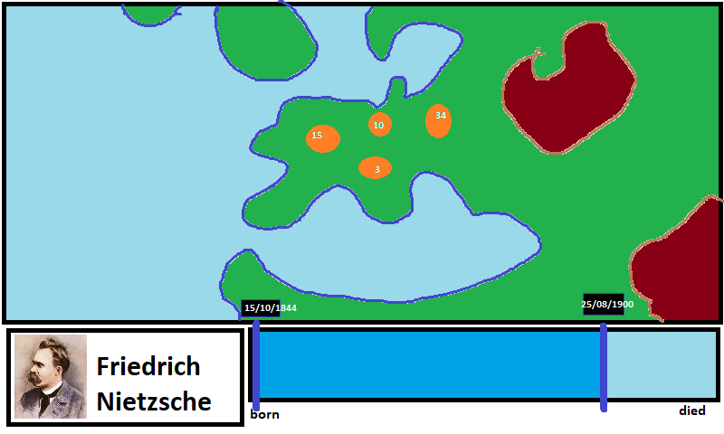

Where People Been  - A Chronological view of where historic people been
=======================================================================

This project aims at rendering on a map where history people been during their
lifes.

The application displays a map with markers where the selected personnality
lived or travelled to, a personnality selection widget in the lower-left corner
and a timeline starting at the personnality's birth and ending at is death.
The timeline should be configurable in order to let users focus on certain
periods of the personnality's life.

Here is a quick-and-dirty representation of what the final application should
look like:

